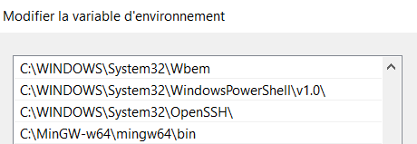

# Pg Engine

An ecs based Game/Graphical Engine

# Exemple of game possible

## Tetris clone

A full fledge tetris clone using texture, entities and sound effects using this engine

# How to build

## Download external depencies

The first step to build is to download the two external depencies of this project:
- Mingw64 (or any other c++ compiler)
- Cmake

The first step is to install [Mingw 64](https://www.mingw-w64.org/downloads/) 

Once mingw is installed, add the bin folder in your PATH to use make !

The next step is to install Cmake

### Linux
- `sudo apt install cmake`
- `sudo apt-get install libgl1-mesa-dev`
- `sudo apt-get install libsdl2-dev`
- `mkdir release`
- `cd release`
- `cmake -S ../ -B .`
- `cmake --build . --target all -j 11`

### For windows, linux and apple
Once those depencies are resolved, you can build the application with:
- `cmake --build release --config Release --target all` in release mode
- `cmake --build debug --config Debug --target all` in debug mode

Or use the different task set up for vscode

### For webassembly
- `mkdir em`
- `cd em`
- `emcmake cmake ..`
- `cmake --build . --target all -j 11`

To test and deploy web build
- `emrun .\PgEngine.html`

## Profiling App

To profile the Taskflow scheduling of the application, you need to enable the profiler in your environment by setting the filename in the environment variable

On windows:
- `$env:TF_ENABLE_PROFILER=simple.json`

Create all the uml using:
https://plantuml.com/fr/sequence-diagram